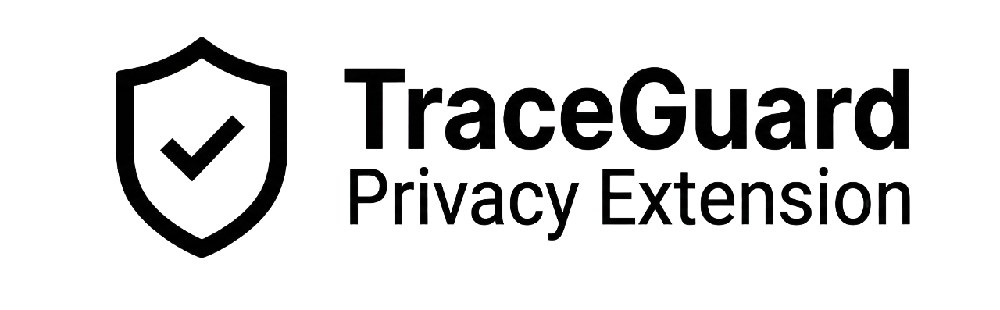
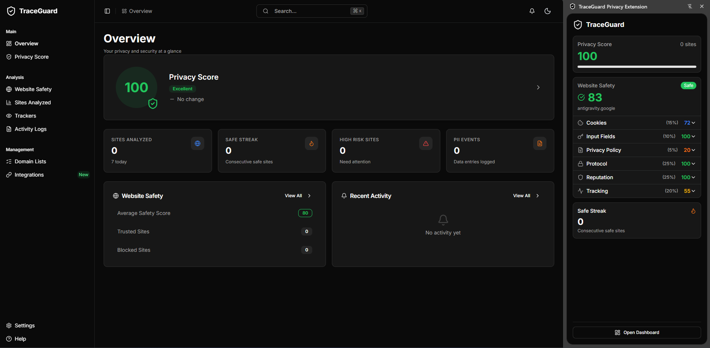

<div id="top">

<div align="center">
  <a href="https://github.com/luca-liceti/TraceGuard-Privacy-Extension">
    
  </a>
</div>

<p align="center">
  <br>
  <em>Real-time privacy scoring and protection for your digital footprint.</em>
</p>

<p align="center">
  <a href="https://github.com/luca-liceti/TraceGuard-Privacy-Extension/blob/main/LICENSE">
    
  </a>
  <a href="https://github.com/luca-liceti/TraceGuard-Privacy-Extension/stargazers">
    
  </a>
  <a href="https://github.com/luca-liceti/TraceGuard-Privacy-Extension/issues">
    
  </a>
  <br>
  <a href="https://react.dev">
    
  </a>
  <a href="https://www.typescriptlang.org/">
    
  </a>
  <a href="https://vitejs.dev/">
    
  </a>
</p>

</div>

<hr>

## Quick Links

- [Introduction](#introduction)
- [Preview](#preview)
- [Features](#features)
- [Architecture](#architecture)
- [Getting Started](#getting-started)
- [Configuration](#configuration)
- [Roadmap](#roadmap)
- [Contributing](#contributing)

<hr>

## Introduction

**TraceGuard** is a sophisticated privacy extension designed to empower users with real-time insights into how websites interact with their data. Unlike traditional blockers that operate silently, TraceGuard quantifies your privacy through two innovative metrics: **Website Safety Score (WSS)** and **User Privacy Score (UPS)**.

This project was built to solve the lack of transparency in modern web browsing. By analyzing trackers, cookies, form inputs, and privacy policies in real-time, TraceGuard gives you the knowledge to make informed decisions about your digital footprint.

<hr>

## Preview

<div align="center">
  
  <br>
  <em>TraceGuard Dashboard — Real-time privacy analytics at a glance</em>
</div>

<hr>

## Features

<details>
<summary><strong>🛡️ Core Scoring System</strong></summary>
<br>

| Feature | Description |
|:--- | :--- |
| **Website Safety Score (WSS)** | Calculates a 0-100 safety rating for every site visited based on 6 weighted factors: Protocol, Reputation, Tracking, Cookies, Input Fields, and Policy strength. |
| **User Privacy Score (UPS)** | A dynamic behavioral score that reflects your personal privacy health. It degrades when visiting risky sites or exposing PII, and recovers as you maintain safe browsing habits. |

</details>

<details>
<summary><strong>🔍 Real-Time Detection</strong></summary>
<br>

| Module | Capability |
|:--- | :--- |
| **Tracker Analysis** | Identifies and catalogues 70+ known tracking domains and analytics scripts in real-time. |
| **PII Monitoring** | Detects sensitive form inputs (passwords, emails, SSNs) and warns you before you submit data to low-trust sites. |
| **Cookie Auditing** | Scans for third-party and cross-site tracking cookies that compromise your anonymity. |
| **Policy Grading** | Integrates with the **ToS;DR API** to fetch and display human-readable grades (A-F) for website terms of service. |

</details>

<details>
<summary><strong>📊 Dashboard & UI</strong></summary>
<br>

| component | Description |
|:--- | :--- |
| **Interactive Dashboard** | A fully responsive control center built with **shadcn/ui** and **Recharts**, offering deep dives into your privacy history. |
| **Side Panel** | Instant access to the current site's WSS breakdown and threat analysis without leaving the page. |
| **Activity Logging** | Comprehensive logs of every scan, score change, and blocked threat for full transparency. |

</details>

<hr>

## Architecture

TraceGuard is built on a modern Direct-to-Browser stack, leveraging Manifest V3 for performance and security.

### Project Structure

```sh
traceguard-extension/
├── src/
│   ├── background/       # Service worker & continuous monitoring logic
│   ├── content/          # Content scripts & DOM detectors
│   │   └── detectors/    # Modular detection engines (cookies, trackers, etc.)
│   ├── components/       # Reusable UI components (shadcn/ui)
│   ├── dashboard/        # Main specific privacy dashboard application
│   ├── sidepanel/        # Context-aware side panel application
│   └── lib/              # Shared utilities, scoring algorithms, and types
├── public/               # Static assets and icons
└── manifest.json         # Extension Manifest V3 configuration
```

### Technology Stack

| Category | Technologies |
|:--- | :--- |
| **Core** | [React 19](https://react.dev/), [TypeScript 5](https://www.typescriptlang.org/) |
| **Build** | [Vite 7](https://vitejs.dev/), [CRXJS](https://crxjs.dev/vite-plugin) |
| **Styling** | [Tailwind CSS](https://tailwindcss.com), [shadcn/ui](https://ui.shadcn.com/) |
| **State** | React Hooks, Chrome Storage API |
| **Testing** | [Vitest](https://vitest.dev/), Testing Library |

<hr>

## Getting Started

### Prerequisites

Ensure you have the following installed:
*   **Node.js** (v18 or higher)
*   **npm** (v9 or higher)

### Installation

1.  **Clone the repository**
    ```sh
    git clone https://github.com/luca-liceti/TraceGuard-Privacy-Extension.git
    cd traceguard-extension
    ```

2.  **Install dependencies**
    ```sh
    npm install
    ```

3.  **Build the extension**
    ```sh
    npm run build
    ```

4.  **Load into Chrome**
    *   Open `chrome://extensions/`
    *   Enable **Developer mode** (top right toggle)
    *   Click **Load unpacked**
    *   Select the `dist` folder generated in the project directory

<hr>

## Configuration

TraceGuard works out of the box, but offers deep customization via the Settings page:

| Setting | Description | Default |
|:--- | :--- | :--- |
| **WSS Threshold** | Minimum safety score before an alert is triggered | `70` |
| **PII Detection** | Enable monitoring of sensitive input fields | `Enabled` |
| **Data Retention** | Number of days to keep detailed activity logs | `30 days` |
| **Theme** | UI Theme preference (Light/Dark/System) | `System` |

<hr>

## Roadmap

- [x] **MVP Phase**: Core WSS/UPS scoring, 6 detectors, and Dashboard V1
- [ ] **Data Ecosystem**: Integration with uBlock Origin & Privacy Badger
- [ ] **Cross-Device Sync**: Encrypted syncing of privacy scores across browsers
- [ ] **Enhanced Reporting**: Weekly privacy summaries and exportable reports
- [ ] **v2.0**: Automated data removal requests (GDPR/CCPA)

<hr>

## Contributing

Contributions are what make the customized privacy community such an amazing place to learn, inspire, and create. Any contributions you make are **greatly appreciated**.

1.  Fork the Project
2.  Create your Feature Branch (`git checkout -b feature/AmazingFeature`)
3.  Commit your Changes (`git commit -m 'Add some AmazingFeature'`)
4.  Push to the Branch (`git push origin feature/AmazingFeature`)
5.  Open a Pull Request

<hr>

## Acknowledgments

TraceGuard enables its premium experience thanks to these amazing open-source projects:

-   [shadcn/ui](https://ui.shadcn.com/) - For the beautiful, accessible component system.
-   [Recharts](https://recharts.org/) - For the composable charting library.
-   [Vite](https://vitejs.dev/) - For the next-generation frontend tooling.
-   [Lucide](https://lucide.dev/) - For the clean and consistent icon set.

<hr>

<p align="center">
  <a href="https://github.com/luca-liceti/TraceGuard-Privacy-Extension/blob/main/LICENSE">
    
  </a>
</p>
