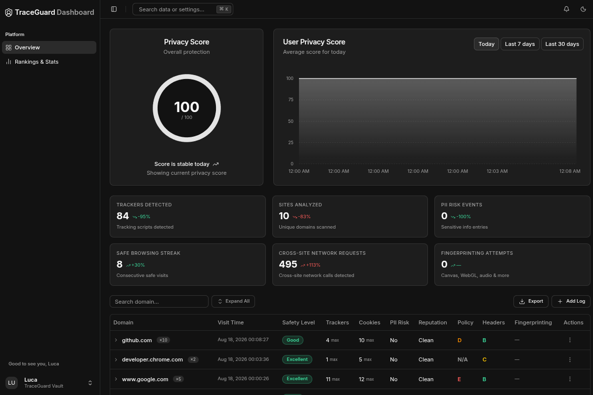
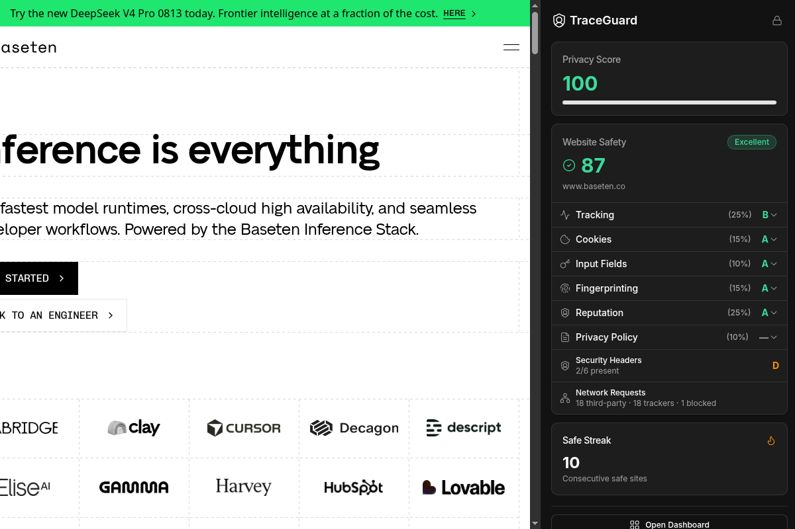

# TraceGuard Privacy Extension


[](LICENSE)
[](https://github.com/luca-liceti/TraceGuard-Privacy-Extension/actions/workflows/ci.yml)
[](https://chromewebstore.google.com/detail/traceguard-privacy-extens/memioiifpdmcllgojjglncadobmhdhlo)

TraceGuard is a powerful, real-time privacy scoring and auditing Chrome Extension. It empowers users with transparent insights into how websites interact with their data, helping them make informed decisions about their digital footprint.

## Why TraceGuard is Useful

Unlike traditional blockers that operate silently, TraceGuard provides transparent, quantified privacy analysis through two innovative metrics:
- **Website Safety Score (WSS)**: A 0-100 safety rating for every site visited based on reputation, tracking, cookies, input fields, and policy strength.
- **User Privacy Score (UPS)**: A dynamic behavioral score that reflects your personal privacy health over time.

### Key Features
- **Real-Time Tracker Detection**: Identifies third-party trackers using a curated list plus bundled databases (DuckDuckGo Tracker Radar, EasyPrivacy, Disconnect).
- **PII Monitoring**: Detects sensitive form inputs and warns you before you submit data to low-trust sites.
- **Cookie Auditing**: Detects tracking cookies from `Set-Cookie` headers and the DOM, cookie names and metadata only, never values (no `cookies` permission required).
- **Policy Grading**: A hybrid ToS;DR integration, a bundled database by default, with an optional (off-by-default) live lookup for unrated sites.
- **Modern Dashboard**: An interactive, responsive control center built with React, Vite, Tailwind CSS, and shadcn/ui.
- **Local-First**: Everything runs on-device, no accounts, no telemetry, and sensitive data is encrypted behind a master password (the "vault").

## Screenshots





## Threat Feed & Signed Updates

The malware/phishing blocklist is built locally from public, no-account feeds ([OpenPhish](https://openphish.com/feed.txt) and [phishunt](https://phishunt.io)), matching is done entirely on-device, so your browsing is never sent to a third party.

To keep that blocklist fresh between extension releases, the background worker periodically fetches a **signed** update (`phishlist.signed.json`) and only accepts it when its Ed25519 signature verifies against an embedded public key, it is fresher than the last accepted feed, and it is newer than what is already stored. Any failure falls back to the bundled snapshot.

### Key management

```bash
npm run generate:threat-keys   # creates scripts/keys/threat-signing-key.pem (gitignored, KEEP SECRET)
npm run build:phishlist        # rebuild src/assets/phishlist.json from the feeds
npm run sign:phishlist         # sign it -> src/assets/phishlist.signed.json (commit this)
```

The private key must **never** be committed. Store it as a GitHub Actions secret named `THREAT_SIGNING_KEY` so the release workflow can sign fresh feeds. Rotating the key invalidates all previously signed feeds, regenerate, re-sign, and redeploy the public key (`THREAT_FEED_PUBLIC_KEY_HEX` in `src/background/services/threat-feed.ts`) together.

## Getting Started

### Prerequisites
- [Node.js](https://nodejs.org/) (v18 or higher)
- [npm](https://www.npmjs.com/) (v9 or higher)
- Google Chrome or a Chromium-based browser

### Installation & Setup

1. **Clone the repository**
   ```bash
   git clone https://github.com/luca-liceti/TraceGuard-Privacy-Extension.git
   cd TraceGuard-Privacy-Extension/traceguard-extension
   ```

2. **Install dependencies**
   ```bash
   npm install
   ```

3. **Build the extension**
   ```bash
   npm run build
   ```
   *(For active development with hot-reloading, run `npm run dev`)*

4. **Load into Chrome**
   - Open Chrome and navigate to `chrome://extensions/`
   - Enable **Developer mode** in the top right corner
   - Click **Load unpacked**
   - Select the `dist` folder located inside the `traceguard-extension` directory

### Usage Example
Once installed, TraceGuard runs automatically in the background. You can open the side panel by clicking the extension icon or use the Command Palette (`Cmd+K` / `Ctrl+K`) in the dashboard to navigate between your Privacy Score, Rankings, and Settings.

## Getting Help

If you encounter issues or have questions, please use the following resources:
- **Discussions**: [GitHub Discussions](https://github.com/luca-liceti/TraceGuard-Privacy-Extension/discussions) for questions, ideas, and community support.
- **Issue Tracker**: [GitHub Issues](https://github.com/luca-liceti/TraceGuard-Privacy-Extension/issues) to report bugs or request features.
- **Documentation**: Additional setup notes and architectural details are available in the [docs/](docs/) directory.
- **Privacy Policy**: Read our privacy commitments in [PRIVACY.md](PRIVACY.md).

## Maintainers and Contributing

**TraceGuard** is actively maintained by [@luca-liceti](https://github.com/luca-liceti) and the open-source privacy community.

We welcome contributions of all kinds, from bug fixes to new detectors! To get started:
1. Please read our contribution guidelines in [CONTRIBUTING.md](CONTRIBUTING.md).
2. Run `npm run typecheck` and `npm run test:run` (or `npm run build`) to verify your changes before submitting a pull request.

*Together, we can create a safer, more transparent web.*
